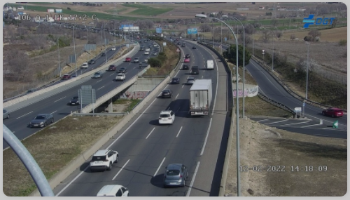
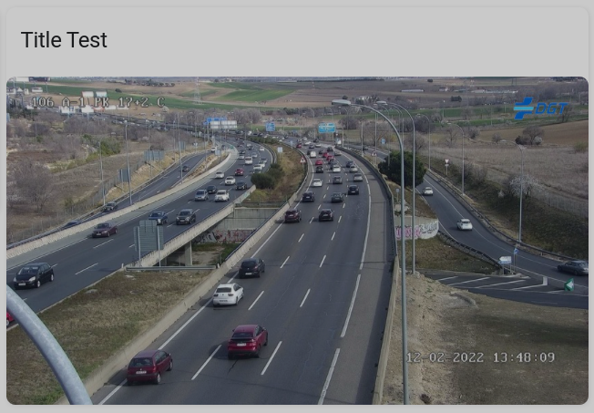

# lovelace-auto-update-image-card
Simple card to load and image from an URL and auto update it from time to time.

## Usage
Usage is quite simple, you have to set it up as a custom card and provide and url and some other optional params:

|Paramenter|Description|Required|Default Value|
|:---------|:----------|:-------|:------------|
|url|Image's URL|**YES**||
|update_interval|Time between updates, in seconds|No|60|
|title|Card title|No||
|width|Card's width|No|Default HA card|

## Examples and Screenshots
Simple example, no title and normal size (same of a default card):

```yaml
type: custom:auto-update-image-card
update_interval: 180
url: http://infocar.dgt.es/etraffic/data/camaras/605.jpg
```

it renders like this:



Full example with title and a bigger card:

```yaml
type: custom:auto-update-image-card
title: Title Test
update_interval: 180
url: http://infocar.dgt.es/etraffic/data/camaras/605.jpg
width: 130%
```

gives you this card:

